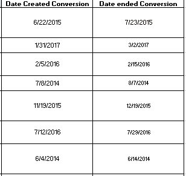

# Kickstart My Chart

### My Final excel sheet:

* Conditional formatting used to fill each cell in the `state` column with a different color, depending on whether the associated campaign was successful, failed, or canceled, or is currently live.

* New column created called `Percent Funded` that uses a formula to uncover how much money a campaign made to reach its initial goal.

  * Conditional formatting used to fill each cell in the `Percent Funded` column using a three-color scale.

  * `Average Donation` Column created that uses a formula to uncover how much each backer for the project paid on average.

  * `Category` and `Sub-Category` columns created that use formulas to split the `Category and Sub-Category` column into two parts.

  * Creat a pivot table on new worksheet that will analyze the initial worksheet to count how many campaigns were successful, failed, canceled, or are currently live per **category**.

  * Stacked column pivot chart created that can be filtered by country based on the table created.

    ### .png from excel book:
    

  * New sheet created with a pivot table that analyzes the initial sheet to count how many campaigns were successful, failed, or canceled, or are currently live per **sub-category**.

  * Create a stacked column pivot chart that can be filtered by country and parent-category based on the table you have created.

    ### .png from excel book:
    

  * The dates stored within the `deadline` and `launched_at` columns use Unix timestamps. Fortunately for us, [there is a formula](https://www.extendoffice.com/documents/excel/2473-excel-timestamp-to-date.html) that can be used to convert these timestamps to a normal date.

  * Create a new column named `Date Created Conversion` that will convert the data contained within `launched_at` into Excel's date format.

  * Create a new column named `Date Ended Conversion` to convert the data contained within `deadline` into Excel's date format.
  
    ### .png from excel book:
    

  * Create a new sheet with a pivot table with a column of `state`, rows of `Date Created Conversion`, values based on the count of `state`, and filters based on `parent category` and `Years`.

  * Now create a pivot chart line graph that visualizes this new table.

    ### .png from excel book:
    
